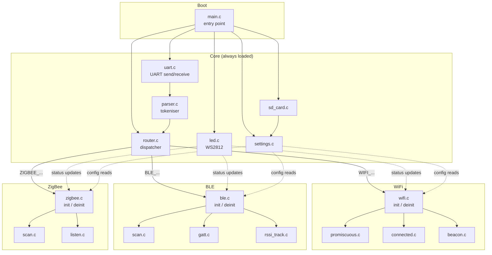
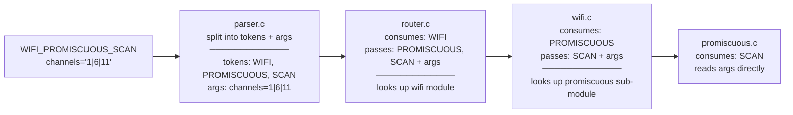

# Firmware Structure

## Directory layout

```
main/
├── main.c              Entry point — init sequence and main loop
├── uart.c/h            UART send/receive
├── parser.c/h          Tokenises incoming lines into command + args
├── router.c/h          Walks command tokens, dispatches to modules
├── led.c/h             WS2812 LED driver
├── sd_card.c/h         SD card mount/read/write
├── settings.c/h        Settings read/write (depends on sd_card)
├── wifi/
│   ├── wifi.c/h        WiFi module — init/deinit, owns mode state
│   ├── promiscuous.c   Promiscuous sub-module (channel scan, device scan)
│   ├── connected.c     Connected sub-module (IP sweep, internet services)
│   └── beacon.c        Beacon spam sub-module
├── ble/
│   ├── ble.c/h         BLE module — init/deinit
│   ├── scan.c          BLE scan sub-module
│   ├── gatt.c          GATT inspect sub-module
│   └── rssi_track.c    RSSI tracking sub-module
└── zigbee/
    ├── zigbee.c/h      ZigBee module — init/deinit
    ├── scan.c          Channel scan sub-module
    └── listen.c        Packet listen sub-module
```

---

## Module structure



---

## Command routing

Commands are routed by progressively consuming `_`-delimited tokens from the command name.
Each layer consumes only its own token and passes the remainder down — so depth is not hardcoded.



The same mechanism handles system commands — `router.c` handles `SYS_*` and `LED_*` directly without delegating to a sub-module, since those have no further depth.

---

## Shared context

Core services (LED, SD, settings, UART send) are accessible as module-level singletons initialised in `main.c`. Radio modules call them directly rather than having them injected — appropriate for single-threaded embedded firmware.
